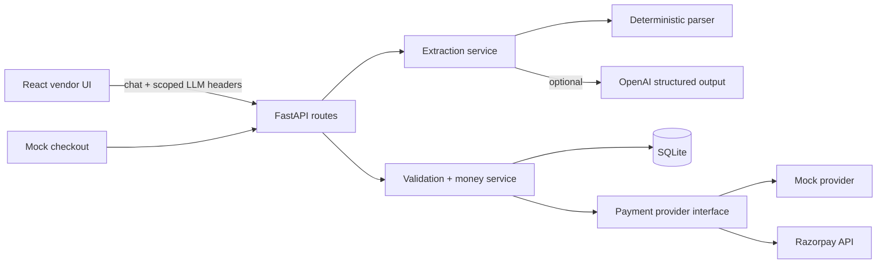

# PayLink Assistant

PayLink Assistant is a conversational payment-link MVP for vendors. Describe a charge in plain language, review the extracted draft, confirm it explicitly, and complete the full flow with the built-in mock provider. OpenAI structured extraction and Razorpay link creation are optional; the local parser and mock checkout work without credentials.

## Features

- Multi-turn chat with deterministic extraction and optional OpenAI structured extraction
- Editable customer, item, price, discount, tax, deadline, expiry, and description fields
- Integer-minor-unit financial calculations performed only by the FastAPI backend
- Explicit confirmation plus idempotency and conditional status transitions
- SQLite persistence, Alembic migration, history, details, cancellation, expiry, and mock payment completion
- Memory-only OpenAI key handling by default, optional tab-scoped `sessionStorage`, scoped request headers, and log redaction
- Provider-neutral payment boundary with mock and Razorpay adapters
- Responsive React UI with history and public mock-checkout routes

## Architecture



The enforced boundary is: **the LLM extracts fields, the backend validates and calculates, and the payment provider creates the link**. No LLM code writes to the database, calculates an authoritative total, or calls a payment provider.

## Stack

- Backend: Python 3.12, FastAPI, Pydantic v2, SQLAlchemy 2 typed ORM, SQLite, Alembic, HTTPX, OpenAI SDK, Pytest
- Frontend: React 19, TypeScript, Vite, React Router, TanStack Query, React Hook Form, Zod, Axios, Vitest

## Project layout

```text
backend/
  alembic/                 migration environment and initial migration
  app/api/routes/          thin HTTP route handlers
  app/core/                settings, errors, secret-redacted logging
  app/db/                  typed models and session setup
  app/providers/           OpenAI and payment-provider adapters
  app/repositories/        query layer
  app/schemas/             request/response contracts
  app/services/            extraction, money, chat, lifecycle, idempotency
  tests/                   unit and API integration tests
frontend/
  src/api/                 typed, centrally scoped API functions
  src/features/            AI settings and editable request form
  src/pages/               chat, history, detail, mock checkout
  src/components/          reusable status and payment summaries
```

## Prerequisites

- Python 3.12 (3.11+ should work)
- Node.js 20+ and npm
- Optional: Docker Desktop

## Local setup — macOS/Linux

Backend terminal:

```bash
cd backend
python3 -m venv .venv
source .venv/bin/activate
pip install -r requirements.txt
cp .env.example .env
alembic upgrade head
uvicorn app.main:app --reload
```

Frontend terminal:

```bash
cd frontend
cp .env.example .env
npm install
npm run dev
```

Open `http://localhost:5173`.

## Local setup — Windows PowerShell

Backend terminal:

```powershell
cd backend
py -3.12 -m venv .venv
.\.venv\Scripts\Activate.ps1
pip install -r requirements.txt
Copy-Item .env.example .env
alembic upgrade head
uvicorn app.main:app --reload
```

Frontend terminal:

```powershell
cd frontend
Copy-Item .env.example .env
npm install
npm run dev
```

## Verification

```bash
cd backend
../.venv/bin/alembic upgrade head
../.venv/bin/pytest -q
../.venv/bin/python -c "from app.main import app; print(app.title)"

cd ../frontend
npm test
npm run typecheck
npm run build
```

## Mock-provider demo

1. Keep AI extraction off; no credentials are needed.
2. Paste: `Create a payment link for 3 keyboards at ₹2,000 each. Payment is due by 18 July 2026 and the link should remain valid for 7 days.`
3. Review or edit the extracted request and save it.
4. Select **Confirm and create payment link**. The button sends a fresh `Idempotency-Key` and disables while pending.
5. Open the generated URL, then select **Simulate payment**.
6. Open **History** or the request details to see `PAID`.

This third demo prompt intentionally asks a follow-up question: `Create a link for Priya for 5 software licences costing ₹1,200 each.`

## OpenAI extraction and key security

Open **AI Settings**, enable OpenAI, enter a model and key, and test the connection. The browser calls only the FastAPI backend. The key is attached as `X-LLM-API-Key` only by `sendChat` and `testLlm`; payment, history, health, mock, and confirmation functions cannot accept it.

The key lives in React memory by default and disappears on reload. Selecting **Remember until this browser tab is closed** uses `sessionStorage`. The application never uses `localStorage`, cookies, URLs, SQLite, conversation messages, or payment records for the key. Production deployments must use HTTPS; the backend rejects user keys over insecure non-local production requests. Browser extensions and compromised frontend code can still read in-page secrets, so server-managed keys are safer for managed deployments.

To use a server key, set:

```text
LLM_PROVIDER=openai
OPENAI_DEFAULT_MODEL=<model available to your account>
OPENAI_API_KEY=<server secret>
ALLOW_SERVER_LLM_KEY=true
```

Do not commit `.env`.

## Optional Razorpay

```text
PAYMENT_PROVIDER=razorpay
RAZORPAY_KEY_ID=<test key id>
RAZORPAY_KEY_SECRET=<test secret>
RAZORPAY_WEBHOOK_SECRET=<webhook secret>
```

The adapter sends integer minor-unit amounts, the unique `PAY-...` reference, and expiry. Credentials remain backend-only. The webhook endpoint verifies `X-Razorpay-Signature` before accepting an event.

## Environment variables

The complete lists are in `backend/.env.example` and `frontend/.env.example`. Important backend values are `DATABASE_URL`, `FRONTEND_ORIGIN`, `APP_TIMEZONE`, `PAYMENT_PROVIDER`, provider credentials, the OpenAI defaults, prompt/context/time limits, and `SUPPORTED_CURRENCIES`. The frontend needs only `VITE_API_BASE_URL` and safe UI defaults—never provider secrets.

## API examples

```bash
curl -X POST http://localhost:8000/api/v1/chat/messages \
  -H 'Content-Type: application/json' \
  -d '{"message":"3 keyboards at ₹2,000 each, valid for 7 days","use_llm_extraction":false,"allow_deterministic_fallback":true}'
```

```bash
curl -X POST http://localhost:8000/api/v1/payment-requests/<request-id>/confirm \
  -H 'Idempotency-Key: demo-confirm-001'
```

Implemented routes:

- `GET /api/v1/health`
- `GET /api/v1/llm/config`, `POST /api/v1/llm/test`
- `POST /api/v1/chat/messages`
- `GET|PATCH /api/v1/payment-requests/{id}`
- `GET /api/v1/payment-requests`
- `POST /api/v1/payment-requests/{id}/confirm`
- `POST /api/v1/payment-requests/{id}/cancel`
- `GET|POST /api/v1/mock/payment-links/{token}` (POST uses `/complete`)
- `POST /api/v1/webhooks/{provider}`

## Docker

```bash
docker compose up --build
```

The UI is available on `http://localhost:5173`, the API on `http://localhost:8000`, and SQLite is retained in the `paylink-data` volume.

## Deploy to Render

The root `render.yaml` deploys one free Docker web service. Its multi-stage image builds the React app, serves it from FastAPI, and runs Alembic migrations at container startup.

1. Push this repository to GitHub, GitLab, or Bitbucket.
2. In Render, select **New > Blueprint** and connect the repository.
3. When Render prompts for `OPENAI_API_KEY`, enter a newly created OpenAI API key. Do not add it to Git or any frontend variable.
4. Apply the Blueprint and wait for `/api/v1/health` to report a healthy service.
5. Open the service URL. AI Settings should report that the server-managed OpenAI key is configured without showing or sending the key to the browser.

The Blueprint explicitly uses `plan: free` and does not declare a paid persistent disk. SQLite is stored at `/tmp/paylink.db`, so all payment records can be lost whenever Render redeploys, restarts, or spins the free service down after inactivity. This is suitable for a demo only. Use a managed database or a paid persistent disk when durable records are required.

Render-specific settings are in `render.yaml` and `Dockerfile.render`. To change the OpenAI model after deployment, update `OPENAI_DEFAULT_MODEL` in the Render service environment. Browser-provided LLM keys are disabled by default with `ALLOW_USER_PROVIDED_LLM_KEYS=false`.

## Troubleshooting

- **Database table missing:** run `alembic upgrade head` from `backend`.
- **CORS error:** make `FRONTEND_ORIGIN` match the browser origin exactly.
- **OpenAI authentication failed:** test the key/model in AI Settings; authentication and permission failures never trigger deterministic fallback.
- **Static 2026 demo date has passed:** edit the deadline/expiration to future values or use `valid for 7 days`.
- **Razorpay not configured:** keep `PAYMENT_PROVIDER=mock` for a credential-free demo.

## Known limitations and production hardening

- The deterministic parser intentionally supports representative English/INR patterns, not arbitrary language.
- SQLite conditional transitions are safe for this MVP; higher write concurrency should use PostgreSQL with row locking and a durable idempotency/outbox workflow.
- Authentication and vendor tenancy are not included. Add identity, tenant scoping, authorization, audit trails, CSRF strategy, and per-user rate limits before production.
- The Razorpay adapter creates links and verifies webhook signatures, but full event-to-status mapping and provider-side cancellation/fetch reconciliation remain follow-up work.
- Add a queue/outbox for provider retries, distributed rate limiting, secret-manager integration, CSP/security headers, observability, backups, and webhook replay protection for production.
